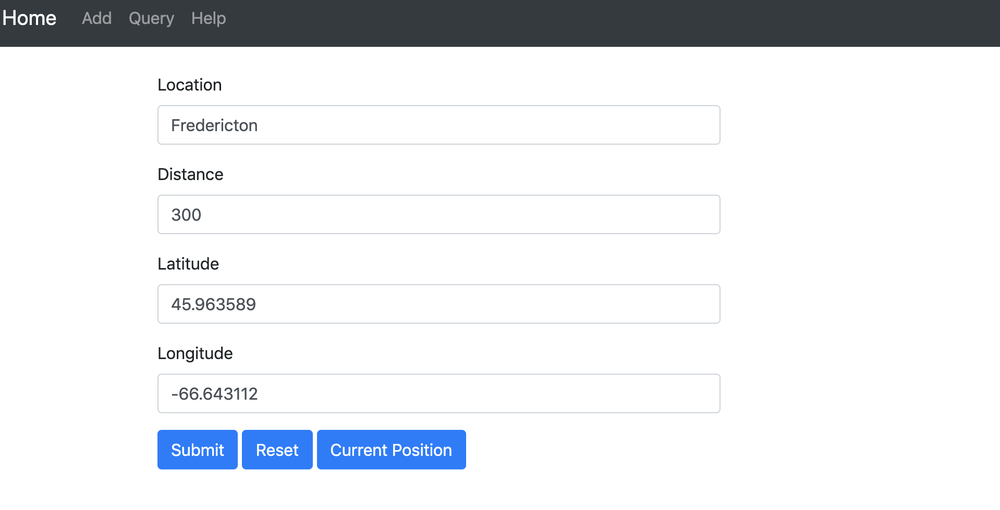
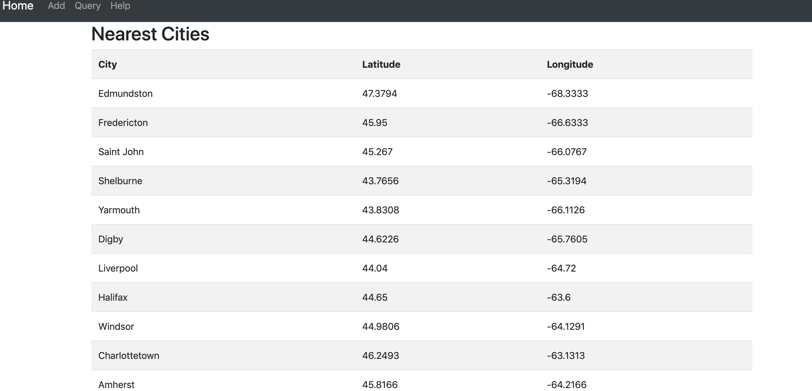

# K-nearest-neighbouring-cities
	
This is a full stack web application build using HTML, Thymeleaf (template engine), Javascript, Java, Spring Boot and Tomcat 
Server. It uses Model View Controller (MVC) architecture with Maven as dependency manager.

## General

The application uses in memory data structure (R-tree) for storing geospatial point data for fast and efficient retrieval of 
K number of nearest cities around a city of interest within a given radius (kms).
The app use the following R-tree library: [R-Tree](https://github.com/davidmoten/rtree)

#### landing page

#### query page

#### results page

### Local setup for development purposes

The following must be installed to run the application locally

* Java 8 or later
* Maven

In the terminal window, navigate into the folder where you downloaded this application, and type the following commands

* mvn package spring-boot:repackage :- to build the executable jar
* mvn spring-boot:run :- to run the application

Open up your browser to localhost:8080

### Technology

* Java8
* Spring Boot
* Maven
* Thymeleaf
* HTML/CSS

